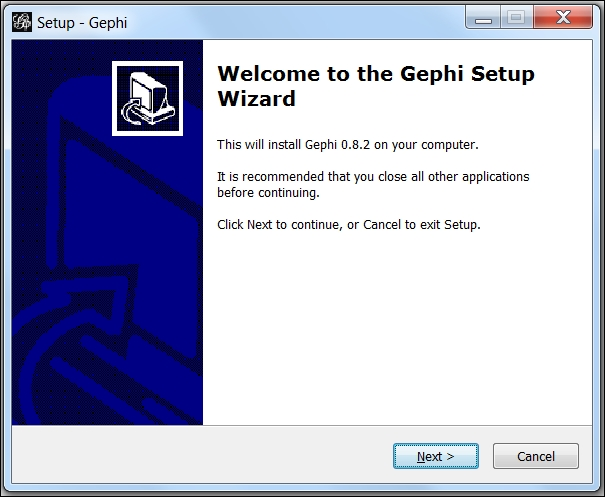
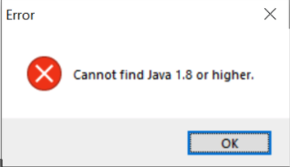
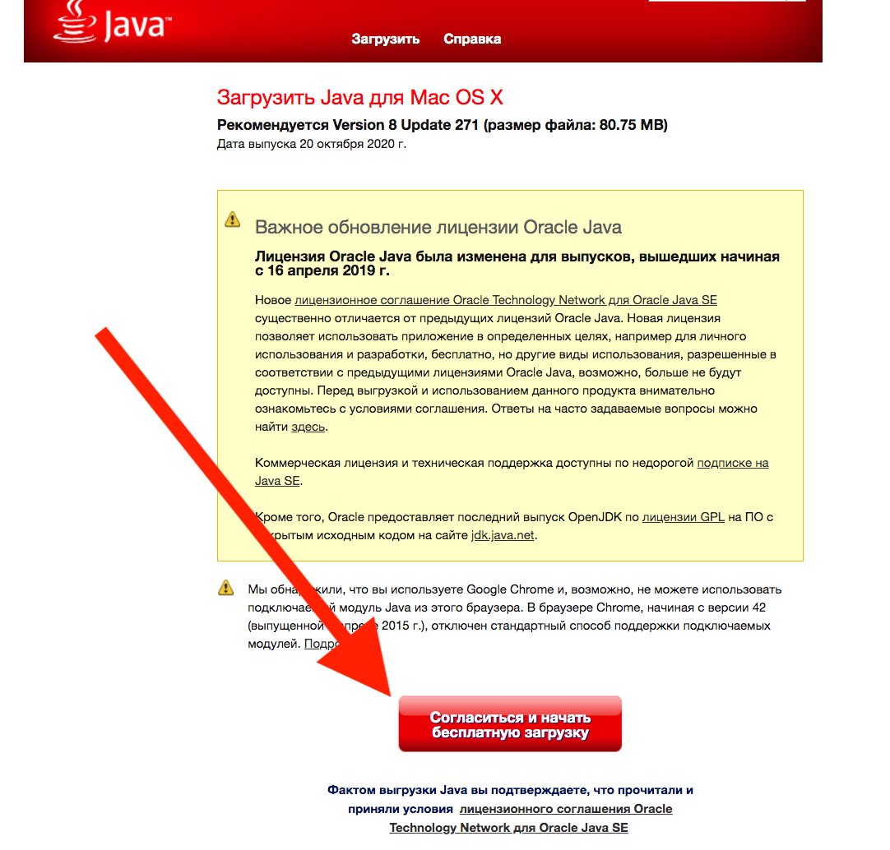
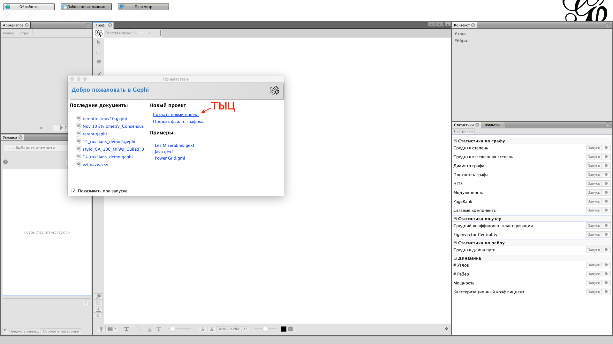
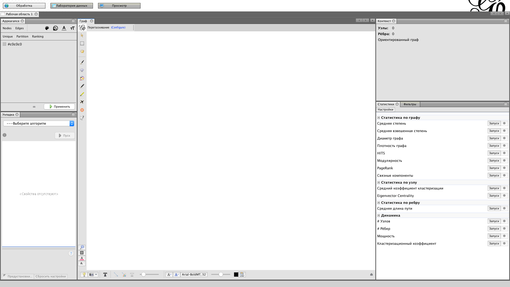

# Простая инструкция по установке Gephi

1. Скачайте Gephi с [официального сайта](https://gephi.org/) 

2. Запустите скачанный установщик и установите Gephi (все галки можно оставить по умолчанию)

3. Теперь у вас установлена Gephi и есть ее иконка. Попробуйте запустить:

4. Вероятно, он вместо запуска пожаловался, что нужна Java 1.8. or higher (если не пожаловался, а запустился и все случилось как в п.6 ниже — все хорошо, успех, больше ничего не надо)

5. Поэтому установите Java с [сайта Java](https://www.java.com/ru/download/)

6. Попробуйте запустить Gephi еще раз. Должно произойти такое:

7. Если не получилось — перезагрузитесь и попробуйте запустить еще раз. 

Если все равно не получилось установить по этой инструкции, попробуйте [вот эту](https://www.dropbox.com/s/r5teusmm11c2b2l/%D0%A3%D1%81%D1%82%D0%B0%D0%BD%D0%BE%D0%B2%D0%BA%D0%B0%20Gephi.pdf?dl=0). Там в конце есть шаманство с конфигами Gephi для совсем сложных случаев. 

Еще ссылки в помощь: 

1. [Страница об установке на сайте Gephi](https://gephi.org/users/install/) — довольно полезная, и там тоже есть про Java
2. [Обучение Gephi на сайте Gephi](https://gephi.org/users/) Там есть неплохие туториалы от создателей Gephi: 
	1. [quickstart в Gephi](https://gephi.org/users/quick-start/)
	2. [визуализация сети](https://gephi.org/users/tutorial-visualization/)
	3. [укладка сети на плоскости](https://gephi.org/users/tutorial-layouts/)

Т.к. в России блочится слайдшер (победа роскомнадзора над здравым смыслом), лучше сразу там качайте PDF-ы туториалов 